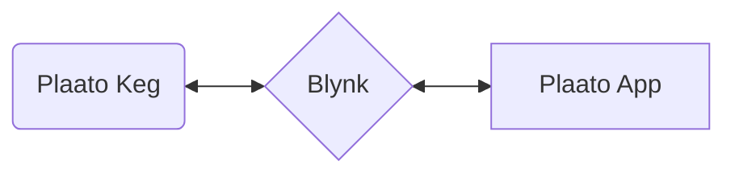
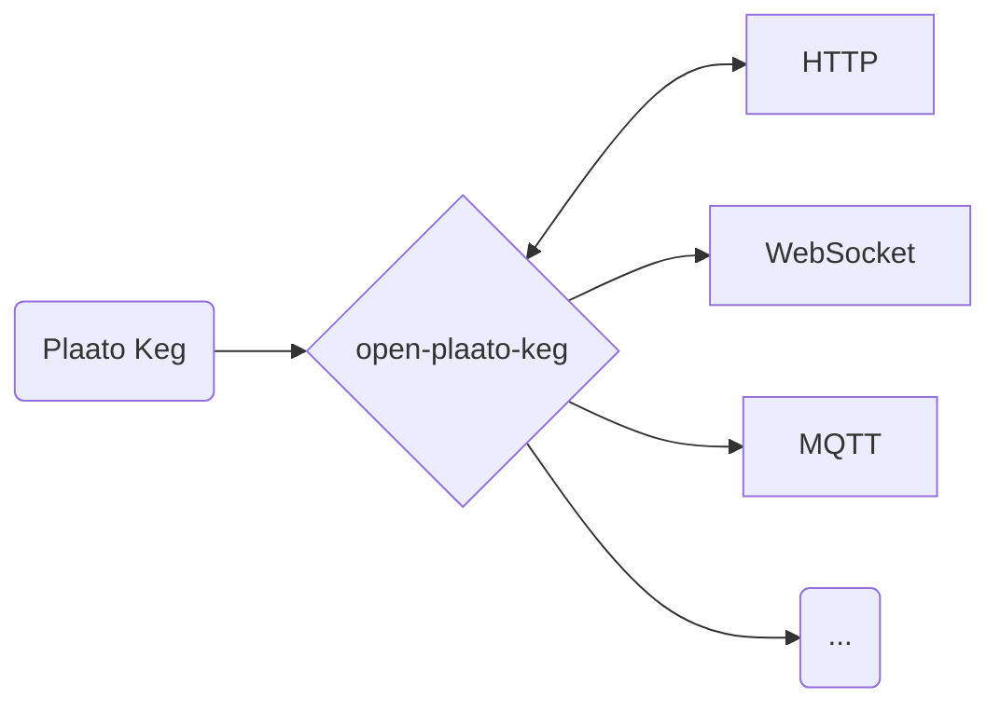
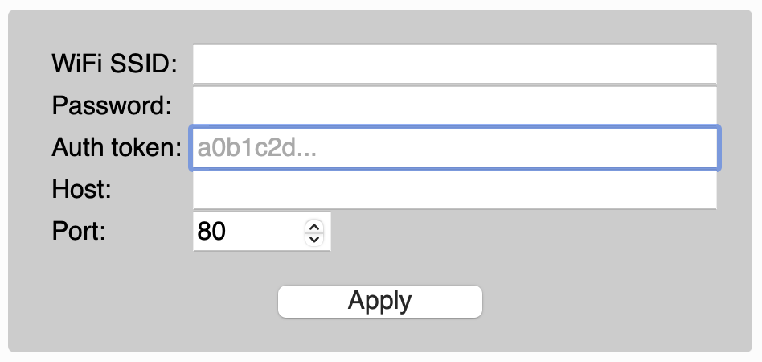
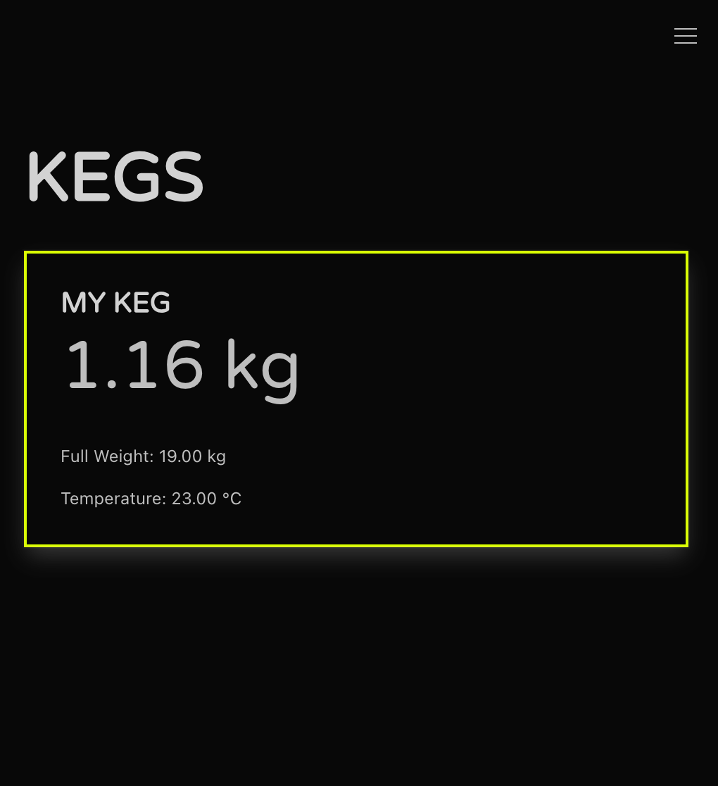
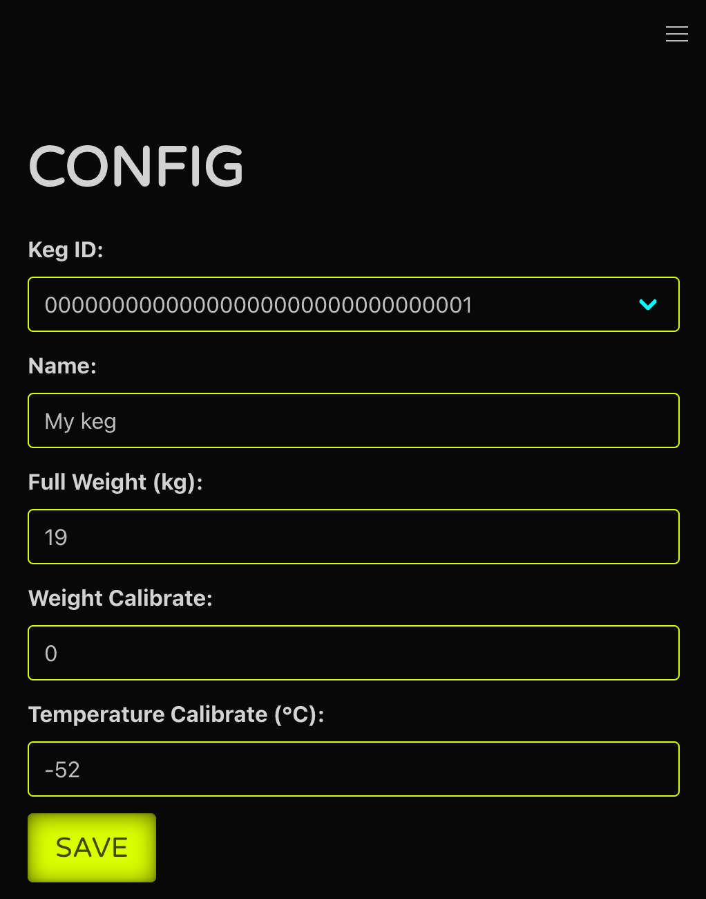

## What is Open Plaato Keg?

Take control of your Plaato Keg! This reverse-engineered solution bypasses the Plaato cloud, keeping your keg data local and accessible even after the cloud service is discontinued.

## Why this exists?

Plaato has decided to stop manufacturing its homebrewing equipment (Airlock, Keg, and Valve). Additionally, the company will shut down the cloud backend that provides data storage and enables the Plaato app to function ([announcement](https://plaato.io/plaato-for-homebrewers/?srsltid=AfmBOop1NiIPtQioYXJ0XWwf53s8FH0wi4M0VTfMo7vrXYixXQ1ITaOk)). This means the app will **cease to work after November 2025**, effectively ending the usability of the devices as they are currently designed.

## How does this work?

The Plaato Keg uses the Blynk cloud platform, configured by Plaato, inivisible to users, for communication. This allows the mobile app to send and receive data from the keg.

### Before:



This local solution decodes the Blynk protocol, giving you the freedom to connect your Plaato Keg with any system or application you choose.

### Now:



## Setup

You need to reset your Plaato Keg to point it to your installation of `open-plaato-keg`. It is done by yellow key provided in the box, or a weak fridge magnet will also do the job.

Reset Steps (copied/compiled) from [here](https://intercom.help/plaato/en/articles/5004706-reset-the-plaato-keg) and [here](https://intercom.help/plaato/en/articles/5004700-how-to-set-up-a-plaato-keg):

1. Power on your Plaato Keg: All three LEDs will light up and blink slowly.
2. Flip your device over and carefully remove the yellow "Reset Key" on the bottom
3. Place the yellow "Reset Key" in the hole marked "Reset" also on the bottom of your Keg and hold it in for around 5 seconds (or place a fridge magnet on top of the two pins under the hole)
4. All three LEDs will turn off and come back on.


Configure steps:
1. Connect to your Plaato Keg - it will now expose Wifi hotspot with named `PLAATO-XXXXX`
2. Go to address http://192.168.4.1
3. Configuration settings will look something like this:

  

4A. Enter your:
  * **WiFi SSID** (beware, Plaato Keg only works on 2.4Ghz networks)
  * (Wifi) **Password**
  * **Auth token** - this is how you will identify your keg if you have more then one - this should be a 32 character hex string (meaning allowed characters are numbers and a-f small letters).
  * **Host** (IP address, or hostname) and **port** (see env variable below -> `KEG_LISTENER_PORT`) should point to your  `open-plaato-keg` installation.

or 4B. Keg can be also configured via this endpoint (simple HTTP GET request with encoded query params):

```
http://192.168.4.1/config?ssid=My+Wifi&pass=my_password&blynk=00000000000000000000000000000001&host=192.168.0.123&port=1234
```

## Deployment

### Docker Images

Docker images are built on Github Container Registry (`ghcr.io`).

Image:
* `ghcr.io/sklopivo/open-plaato-keg:latest` or tagged by semantic version  - eg. `ghcr.io/sklopivo/open-plaato-keg:x.y.z`


Simple run with defaults (exposing HTTP and binary listener port):

* `docker run --rm -it -p 1234:1234 -p 8085:8085 ghcr.io/sklopivo/open-plaato-keg:latest`

### Docker Compose

Sample docker-compose:

```yaml
version: "3.6"
services:
  open_plaato_keg:
    image: ghcr.io/sklopivo/open-plaato-keg:latest
    container_name: open_plaato_keg
    ports:
      - 1234:1234
      - 8085:8085
    restart: always
    environment:
      - DATABASE_FILE_PATH=/db/keg_data.bin
      - KEG_LISTENER_PORT=1234
      - HTTP_LISTENER_PORT=8085
      - MQTT_ENABLED=true
      - MQTT_HOST=192.168.0.123
      - MQTT_PORT=1883
      - MQTT_USERNAME=mqtt_username
      - MQTT_PASSWORD=mqtt_password
      - MQTT_CLIENT=open_plaato_keg
      - BARHELPER_ENABLED=false
      - BARHELPER_API_KEY=
      - BARHELPER_KEG_MONITOR_MAPPING=plaato-auth-key:barhelper-custom-keg-monitor-id
```

### Elixir releases

If Docker isn't your preferred method, you can create an [Elixir Release](https://hexdocs.pm/mix/Mix.Tasks.Release.html) and run it directly on your server. For managing project versions, using [asdf](https://asdf-vm.com) with the  .tool-versions](.tool-versions)  file is recommended.


### Environment variables

| Name                        | Requirement | Default Value                                                   |
|-----------------------------|-------------|-----------------------------------------------------------------|
| KEG_LISTENER_PORT           | Optional   | 1234                                                            |
| HTTP_LISTENER_PORT          | Optional   | 8085                                                            |
| DATABASE_FILE_PATH          | Optional    | priv/db/keg_data.bin                                            |
| MQTT_ENABLED                | Optional    | false                                                           |
| MQTT_HOST                   | Optional    | localhost                                                       |
| MQTT_PORT                   | Optional    | 1883                                                            |
| MQTT_USERNAME               | Optional    | client                                                          |
| MQTT_PASSWORD               | Optional    | client                                                          |
| MQTT_CLIENT_ID              | Optional    | open_plaato_keg_local                                           |
| MQTT_TOPIC                  | Optional    | plaato/keg                                                      |
| BARHELPER_ENABLED           | Optional    | false                                                           |
| BARHELPER_ENDPOINT          | Optional    | https://europe-west1-barhelper-app.cloudfunctions.net/api/customKegMon |
| BARHELPER_API_KEY           | Optional    |                                                                 |
| BARHELPER_UNIT              | Optional    | l                                                               |
| BARHELPER_KEG_MONITOR_MAPPING | Optional  | plaato-auth-key:barhelper-custom-keg-monitor-id                 |


## Integrations

### Rudimentary Web

Merely a showcase how to interact with WebSocket and REST API.

### `/index.html`

* Displays your keg values in real time



### `/config.html`

* Configure your kegs



### HTTP REST API

### `/api/kegs`

* **Method:** `GET`
* **Description:** Retrieves a list of all kegs connected to the Plaato Keg device.
* **Response:** An array of JSON objects, each representing a keg.
   * **Example Response:**
      ```json
        [
          {
            "temperature": 63.89,
            "weight_calibrate": 0,
            "temperature_calibrate": 0,
            "full_weight": 19,
            "temperature_raw_unit": "°C",
            "temperature_raw": 63.89,
            "weight_raw_unit": "kg",
            "weight_raw": -0.06,
            "weight": -0.06,
            "name": "My keg",
            "id": "00000000000000000000000000000001"
          }
        ]
      ```
* **Fields in Response:**
    * `temperature`: Current temperature of the keg in Celsius.
    * `weight_calibrate`: Calibration offset for the weight.
    * `temperature_calibrate`: Calibration offset for the temperature.
    * `full_weight`: Weight of the keg when full in kilograms.
    * `temperature_raw_unit`:  Unit of the raw temperature reading (°C).
    * `temperature_raw`: Raw temperature value from the sensor.
    * `weight_raw_unit`: Unit of the raw weight reading (kg).
    * `weight_raw`: Raw weight value from the sensor.
    * `weight`: Calculated weight of the keg in kilograms.
    * `name`: Name of the keg.
    * `id`: Unique identifier for the keg.

### `/api/kegs/{keg_id}`

* **Method:** `GET`
* **Description:** Retrieves details for a specific keg.
* **Path Parameter:**
    *  `keg_id`: The unique ID of the keg.
* **Response:** A JSON object representing the keg.
    * **Example Response:**
       ```json
        {
            "temperature": 63.89,
            "weight_calibrate": 0,
            "temperature_calibrate": 0,
            "full_weight": 19,
            "temperature_raw_unit": "°C",
            "temperature_raw": 63.89,
            "weight_raw_unit": "kg",
            "weight_raw": -0.06,
            "weight": -0.06,
            "name": "My keg",
            "id": "00000000000000000000000000000001"
        }
       ```
* **Fields in Response:** Same as `/api/kegs`

### `/api/kegs/devices`

* **Method:** `GET`
* **Description:**  Retrieves a list of the device IDs connected to the Plaato Keg system.
* **Response:** An array of strings, where each string is a device ID.
   * **Example Response:**
      ```json
      ["00000000000000000000000000000001"]
      ```

### `/api/kegs/calibrate`

* **Method:** `POST`
* **Description:** Calibrates a keg's settings.
* **Request Body:** A JSON object with the following fields:
    * `id`: The unique ID of the keg.
    * `name`: The name of the keg.
    * `full_weight`:  Weight of the keg when full.
    * `weight_calibrate`: Calibration offset for the weight.
    * `temperature_calibrate`: Calibration offset for the temperature.
* **Example Request Body:**
   ```json
   {"id":"00000000000000000000000000000001","name":"My keg","full_weight":19,"weight_calibrate":0,"temperature_calibrate":-52}
* **Response:**
  * `201 Created` - when everything is ok
  * `400 Bad Request` when parameters validation fails
  * `500 Internal Server error` - when something is f***** up


### WebSocket

All updates can be received via websocket.

```javascript
 const socket = new WebSocket('/ws');
 socket.addEventListener('message', (event) => {
    const updatedKeg = JSON.parse(event.data);
 }
```

Message is in the same format as in API calls:

```json
{
    "temperature": 63.89,
    "weight_calibrate": 0,
    "temperature_calibrate": 0,
    "full_weight": 19,
    "temperature_raw_unit": "°C",
    "temperature_raw": 63.89,
    "weight_raw_unit": "kg",
    "weight_raw": -0.06,
    "weight": -0.06,
    "name": "My keg",
    "id": "00000000000000000000000000000001"
}
```

### MQTT (optional)

If enabled, `open-plaato-keg` can send updates to MQTT topic. Updates are the same model as REST API call (JSON), and will be published on `plaato/keg/{keg_id}` topic (prefix is changable by `MQTT_TOPIC` env variable). See `MQTT_*` environment variables.


### BarHelper (optional)

If enabled `open-plaato-keg` can send updates to [BarHelper](`https://barhelper.no`) via *Custom Keg Monitor* integration.

Steps:
1. Refer to the documentation `https://docs.barhelper.app/english/settings/custom-keg-monitor` and create Custom Keg Monitor and take note of the `Id Number` and your `API key`

Environment variables to set:

* `BARHELPER_ENABLED=true`
* `BARHELPER_ENDPOINT` - you can leave the default (https://europe-west1-barhelper-app.cloudfunctions.net/api/customKegMon)
* `BARHELPER_API_KEY` - your API key
* `BARHELPER_UNIT`- you can leave the default if it is liters
* `BARHELPER_KEG_MONITOR_MAPPING`
  * configuration in CSV key-value format `plaato-auth-key:barhelper-custom-keg-monitor-id,plaato-auth-key:barhelper-custom-keg-monitor-id`
  * eg. "00000000000000000000000000000001:custom-1"

